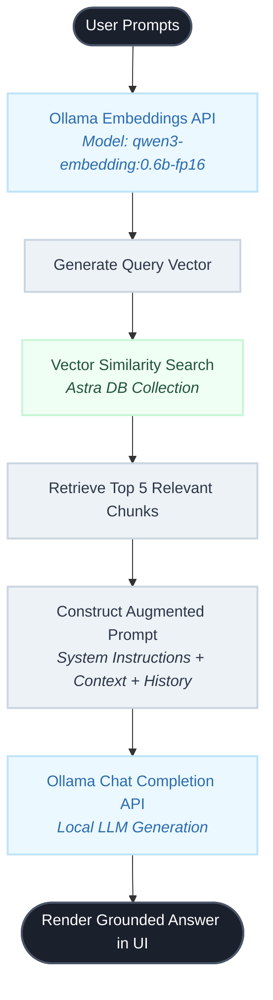

# Formula 1 - GPT
---

## 📌 Project Overview

**F1-GPT** is a **Retrieval-Augmented Generation (RAG)** chat application built for Formula 1 fans, analysts, and anyone who wants fast, context-aware answers about the sport. Instead of relying only on a language model's training data, the app **searches a vector database of scraped F1 content** and feeds the most relevant passages to a **local LLM running via Ollama**.

The result: answers that are more grounded in current articles, Wikipedia pages, official F1 content, and news — while keeping inference **private and cost-free** on your own machine.

---
<!-- ## Why I Built This


**[I built this to learn RAG end-to-end: scraping → embeddings →vector search → LLM prompting.]**

--- -->

## Key Features

| Feature                     | Description                                                                                     |
| --------------------------- | ----------------------------------------------------------------------------------------------- |
| **RAG-powered answers**     | User questions are embedded and matched against F1 documents stored in Astra DB                 |
| **Local LLM via Ollama**    | No OpenAI dependency — chat and embeddings run through Ollama on your machine                   |
| **Web scraping pipeline**   | Puppeteer loads F1 URLs, strips HTML, chunks text, and stores vectors                           |
| **Modern chat UI**          | Next.js app with welcome screen, quick prompts, light/dark theme, and streaming-style responses |
| **Quick prompts**           | One-click starter questions (championship winners, driver careers, calendar, etc.)              |
| **Extensible data sources** | Add more URLs to the seed script to expand knowledge coverage                                   |


---

## How It Works (Architecture)

## 🔄 Data Ingestion Flow

Below is the step-by-step architectural workflow showing how data moves from the raw Formula 1 web URLs down into the cloud vector store:

```mermaid
graph TD
    %% Define Styles & Colors
    classDef init fill:#1a202c,stroke:#4a5568,stroke-width:2px,color:#fff;
    classDef process fill:#edf2f7,stroke:#cbd5e0,stroke-width:2px,color:#2d3748;
    classDef cloud fill:#ebf8ff,stroke:#bee3f8,stroke-width:2px,color:#2b6cb0;
    classDef database fill:#f0fff4,stroke:#c6f6d5,stroke-width:2px,color:#22543d;

    %% Workflow Nodes
    Start([Start Ingestion Pipeline]) --> Init[Initialize AstraDB Client & Splitter]:::init
    Init --> Coll[Create AstraDB Collection <br><i>Dimension: 1536 | Metric: dot_product</i>]:::database

    subgraph Loop [Data Processing Loop per URL]
        Coll --> Fetch[Target F1 URLs Array]:::process
        Fetch --> Scrape[Puppeteer Web Base Loader<br><i>Headless Scrape & HTML Regex Stripping</i>]:::process
        Scrape --> Chunk[Recursive Character Text Splitter<br><i>Size: 512 | Overlap: 100</i>]:::process
        
        subgraph Vectorization [Chunk Insertion Loop]
            Chunk --> OpenAI[OpenAI API Call<br><i>Model: text-embedding-3-small</i>]:::cloud
            OpenAI --> Extract[Extract Float Vector Array]:::process
            Extract --> Insert[AstraDB Collection Insert<br><i>$vector + Raw Text Metadata</i>]:::database
        end
    end

    Insert --> Next{More Chunks/URLs?}:::process
    Next -- Yes --> Fetch
    Next -- No --> End([Pipeline Complete])
```


## 💬 Runtime Query Flow (Ollama + Astra DB)

The diagram below details the operational timeline that takes place from the moment a user posts a prompt in the chat UI to the final local contextual generation:




### Step-by-step

1. **Ingestion (one-time / on demand)** — The seed script (`scripts/loadDb.ts`) uses Puppeteer to scrape F1 web pages, splits content into ~512-character chunks, generates embeddings with Ollama, and stores `{ text, $vector }` documents in **DataStax Astra DB**.
2. **Query time** — When you send a message in the chat:
  - Your question is embedded with the same Ollama embedding model.
  - Astra DB returns the **5 most similar chunks** via vector search.
  - Those chunks are injected into a system prompt.
  - **Ollama LLM** generates the final answer using that context plus conversation history.
3. **Fallback** — If no strong matches are found, the model still answers using its general F1 knowledge (as instructed in the prompt).

---

## Tech Stack


| Layer                | Technology                                                            |
| -------------------- | --------------------------------------------------------------------- |
| **Frontend**         | Next.js 16, React 19, Tailwind CSS 4                                  |
| **Backend**          | Next.js API Route (`/api/chat`)                                       |
| **LLM & Embeddings** | [Ollama](https://ollama.com) via `@langchain/ollama`                  |
| **Vector database**  | [DataStax Astra DB](https://www.datastax.com/products/datastax-astra) |
| **Orchestration**    | LangChain (document loaders, text splitters)                          |
| **Scraping**         | Puppeteer (`PuppeteerWebBaseLoader`)                                  |
| **Language**         | TypeScript                                                            |


### Default Ollama models


| Purpose    | Default model               | Env override             |
| ---------- | --------------------------- | ------------------------ |
| Embeddings | `qwen3-embedding:0.6b-fp16` | `OLLAMA_EMBEDDING_MODEL` |
| Chat / LLM | `llama2:7b`                 | `OLLAMA_LLM_MODEL`       |


You can swap these for any models you've pulled in Ollama (e.g. `llama3`, `mistral`, `gemma`).

---

## Project Structure

```
f1-gpt/
├── app/
│   ├── api/chat/route.ts      # RAG pipeline: embed → search → Ollama LLM
│   ├── components/            # Chat UI (header, messages, input, welcome)
│   ├── page.tsx               # Main chat page
│   └── layout.tsx
├── scripts/
│   └── loadDb.ts              # Scrape F1 URLs → chunk → embed → Astra DB
├── public/                    # Static assets
└── package.json
```

---

## Getting Started

### Prerequisites

- **Node.js** 18+ and npm
- **[Ollama](https://ollama.com)** installed and running locally
- **DataStax Astra DB** account with a vector-enabled collection
- Models pulled in Ollama, for example:

```bash
ollama pull llama2:7b
ollama pull qwen3-embedding:0.6b-fp16
```

### 1. Clone and install

```bash
git clone https://github.com/dineshkanishkar3/f1-gpt.git
cd f1-gpt
npm install
```

### 2. Environment variables

Create a `.env` file in the project root:

```env
# DataStax Astra DB
ASTRA_DB_API_ENDPOINT=https://YOUR-DATABASE-ID-REGION.apps.astra.datastax.com
ASTRA_DB_APPLICATION_TOKEN=AstraCS:...
ASTRA_DB_NAMESPACE=default_keyspace
ASTRA_DB_COLLECTION=f1_collection

# Ollama (local)
OLLAMA_BASE_URL=http://localhost:11434
OLLAMA_EMBEDDING_MODEL=qwen3-embedding:0.6b-fp16
OLLAMA_LLM_MODEL=llama2:7b
```

### 3. Seed the vector database

Make sure Ollama is running, then ingest F1 content:

```bash
npx ts-node ./scripts/loadDb.ts
```

This creates the collection (if needed), scrapes configured F1 URLs, and inserts embedded chunks. The first run can take several minutes depending on your network and hardware.

### 4. Run the app

```bash
npm run dev
```

Open [http://localhost:3000](http://localhost:3000) and start chatting.

---

## Data Sources

The seed script currently ingests content from sources such as:

- Wikipedia (Formula One, championships, driver lists)
- [formula1.com](https://www.formula1.com) (latest news, race results, calendars)
- F1 news and live coverage sites


---

## Screenshots

Home Screen
Loading response
Chat window with response

---

## Roadmap

- [ ] Streaming responses — show Ollama replies token-by-token in the chat
- [ ] Source citations — link answers back to the F1 pages they came from
- [ ] New chat — button to clear the conversation and start fresh